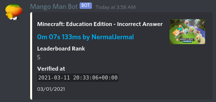
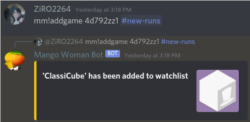
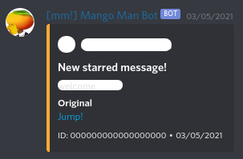

# `speedrunComBot`
**Python 3.8 or Later is required!**

Default Prefix: `mm!`

`speedrunComBot` previously known as `Mango Man Bot`, is a Discord Bot created for Obscure Discord Server to replace [run-get](https://github.com/slashinfty/run-get).

## Key Feature
Sends recently verified runs for any games (from speedrun.com) that you pick. (Also works in DM)

### Setup

- Be in the same server with the bot
- Make sure the bot have permission to send messages and embeds
- Send `mm!addgame <game name|id|url> [#channel]` ( or just `mm!addgame <game name|id|url>` for DM ).  
  Example:  
     `mm!addgame "Minecraft: Bedrock Edition" #new-runs`  
     `mm!addgame mcbe #new-runs`  
     `mm!addgame https://www.speedrun.com/mcbe #new-runs`  
    
  **TIPS**: Use `""` if the game name have spaces.
- Done. It'll automatically send newly verified runs every 1 minutes

## Other Features
- Get information from speedrun.com (`mm!help SRC`)
- Fun commands (such as findseed, roll, rock paper scissors, etc)
- Few utility command (such as userinfo and serverinfo)
- Starboard  
  
- Basic moderation commands (ban, unban, kick, poll, and purge)

## License
[Unlicense (Public Domain)](LICENSE)
